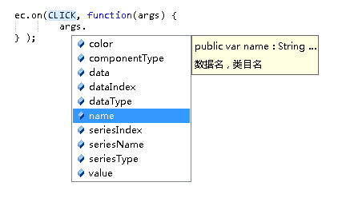

Externs of [echarts v3.x](https://github.com/ecomfe/echarts) for Haxe
-----

**WIP（未完成）**

## Usage

QuickStart :

* Requirements : **haxe** 3.2+ <http://build.haxe.org>

```haxe
import js.Browser.document;

class Main{
	static function main() {
		var ec = js.Echarts.init( document.getElementById("ec") );

		ec.setOption( {
			title: {
				text: "Echarts 入门示例",
			},

			tooltip: {},

			legend: {
				data: ["销量"]
			},

			xAxis: {
				data: ["衬衫","羊毛衫","雪纺衫","裤子","高跟鞋","袜子"]
			},

			yAxis: {},

			series: {
				name: "销量",
				type: "bar",
				data: [5, 20, 36, 10, 10, 20]
			}
		});
	}
}
```

Generated To Javascript :

```js
// Generated by Haxe 3.3.0 (git build development @ cf38ee4)
(function () { "use strict";
var ETest = function() { };
ETest.main = function() {
	echarts.init(window.document.getElementById("ec")).setOption({ title : { text : "Echarts 入门示例"}, tooltip : { }, legend : { data : ["销量"]}, xAxis : { data : ["衬衫","羊毛衫","雪纺衫","裤子","高跟鞋","袜子"]}, yAxis : { }, series : { name : "销量", type : "bar", data : [5,20,36,10,10,20]}});
};
ETest.main();
})();
```

------

IntelliSense（智能语法提示与自动完成）:

  

------

for `haxe.extern.EitherType` :

```haxe
ec.on(ActionEvent.DATARANGESELECTED, function(param) {
	var range: Array<Int> = cast param.selected;
	// or
	trace((param.selected: Array<Int>).length);
	//trace((param.selected: Dynamic).some);
});
```

## Status

<http://echarts.baidu.com/api.html#echarts>

* [x] echarts : `js.Echarts`

* [x] action : `js.echarts.Action`

* [x] events : `js.echarts.Event, MouseEvent, ActionEvent, OptionsEvent`

* [ ] options : `js.echarts.SetOptions`

  - [x] MISC ATTRIBUTES :

  `package js.echarts.options` :

  - [x] title :
  - [x] legend :
  - [x] grid :
  - [x] xAxis :
  - [x] yAxis :
  - [x] polar :
  - [x] radiusAxis :
  - [x] angleAxis :
  - [x] radar :
  - [x] dataZoom :
  - [x] visualMap :
  - [x] tooltip :
  - [x] toolbox :
  - [x] brush :
  - [x] geo :
  - [x] parallel :
  - [x] parallelAxis :
  - [x] singleAxis :
  - [x] timeline :
  - [ ] series :

Optional:

* [ ] echarts.graphic()
  - [x] LinearGradient
  - [x] RadialGradient
  - [ ] ......

* [x] echarts.color : `js.echarts.Color`

### Difference

* `action.tooltip.showTip` is separated into an `SHOWTIPXY` and `SHOWTIP`, However, they are actually the same value

## Helpers

* [GeoJSON for Haxe](https://github.com/kevinresol/geojson)